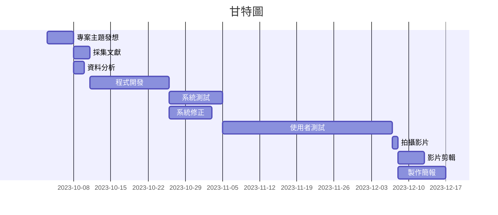
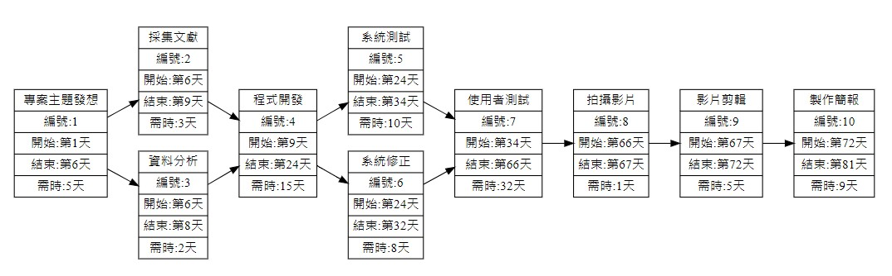
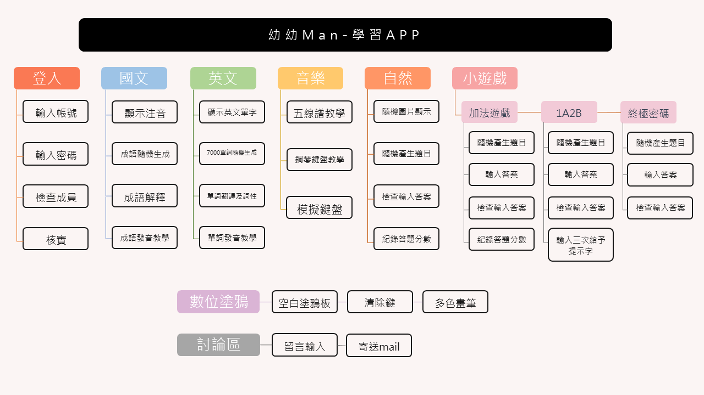
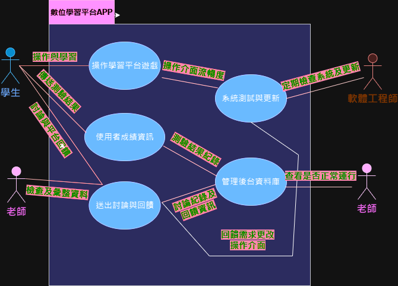
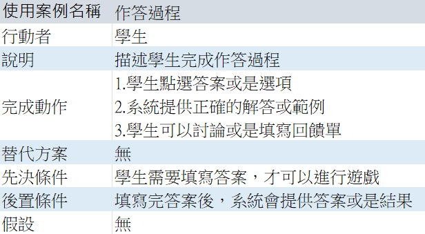
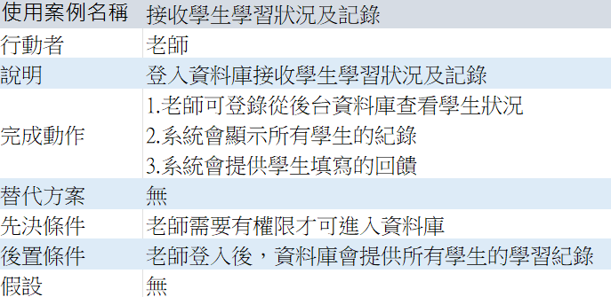
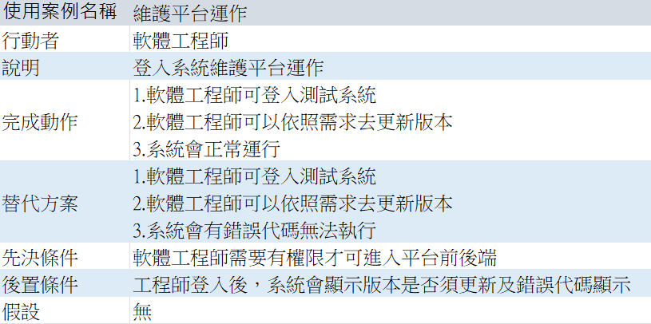
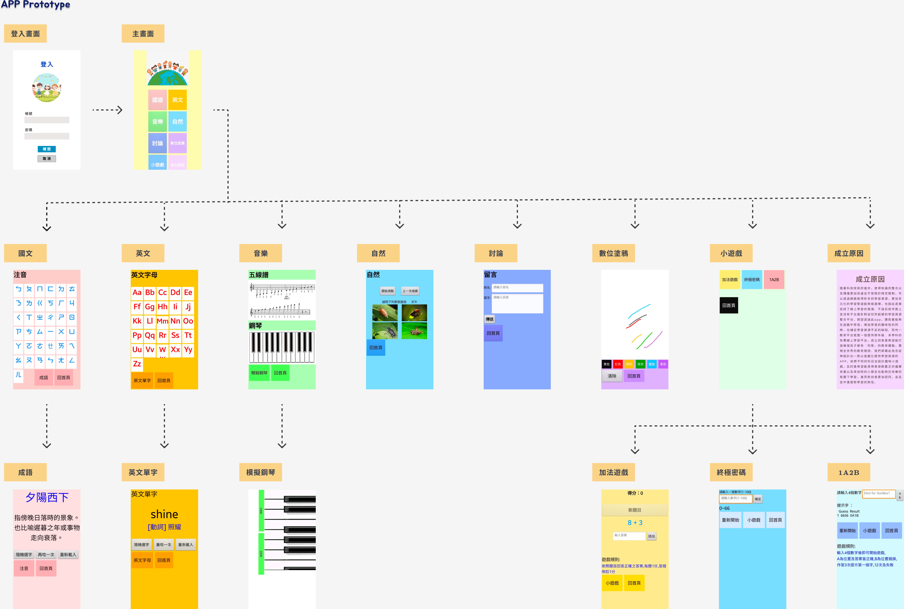

# Group_9 第九組
## 專題名稱:

## 小組成員:
#### *C110193217 劉芸廷*
#### C110193228 翁悅庭
#### C110118223 龔倢
#### C110118213 陳盈臻

## 專題簡介:
隨著科技技術的進步，網際網路隨之蓬勃發展，使得知識的整合以及傳播更加快速且不受限於時空限制，可以透過網路取得許多的學習資源，同時，有更加多元化的學習管道能夠做選擇，也因此逐漸促成了線上學習的風潮。不過目前市面上並沒有平台是針對幼兒所創建的學習資源整合平台，因此本團隊旨在透過此app，讓孩童能夠在遊戲中學習，增加學習的趣味性的同時，也補足學習資源不足的缺陷。而均一教育平台就是一個提供跨年級、多學科的免費線上學習平台，成立初衷是希望能打造每個孩子都有「均等」的教育體驗，實現全世界的教育理想。我們將藉此信念延伸設計出一款以遊戲化提供學習資源的APP，依照不同的科目去設計趣味小遊戲，目的是希望能使得資源較匱乏的偏鄉孩童以及育幼院的小朋友也能夠在快樂的氛圍下學習，進而對自我更加認同，並且從中激發對學習的熱忱。

| **職位** | **姓名** | **學號** | **工作分配**|
| :---     |  :---       |  :---   | :---      |
|   組長   | 劉芸廷   | C110193217  |專案主題發想 採集文獻 資料分析 程式開發 系統測試 使用者測試 拍攝影片 影片剪輯 製作簡報|
|   組員   | 翁悅庭   | C110193228  |專案主題發想 採集文獻 資料分析 程式開發 系統測試 使用者測試 拍攝影片 影片剪輯 製作簡報|
|   組員   | 龔倢     | C110118223  |專案主題發想 採集文獻 資料分析 程式開發 系統測試 使用者測試 拍攝影片 影片剪輯 製作簡報|
|   組員   | 陳盈臻   | C110118213  |專案主題發想 採集文獻 資料分析 程式開發 系統測試 使用者測試 拍攝影片 影片剪輯 製作簡報|

### 分工表
|  *編號*  |  *任務內容*  |  *所需時(天)*  |  *負責人*  |
| :------: |   :------:  |    :------:   |  :------:  |
|     1    |專案主題發想  |       5       |劉芸廷、翁悅庭、龔倢、陳盈臻|
|     2    |   採集文獻   |       3       |劉芸廷、翁悅庭、龔倢、陳盈臻|
|     3    |   資料分析   |       2      |劉芸廷、翁悅庭、龔倢、陳盈臻|
|     4    |   程式開發   |       15       |劉芸廷、翁悅庭、龔倢、陳盈臻|
|     5    |    系統測試  |       10         |劉芸廷、翁悅庭、龔倢、陳盈臻|
|     6    |    系統修正  |       8         |劉芸廷、翁悅庭、龔倢、陳盈臻|
|     7    |   使用者測試   |      32      |劉芸廷、翁悅庭、龔倢、陳盈臻|
|     8    |   拍攝影片   |       1      |劉芸廷、翁悅庭、龔倢、陳盈臻|
|     9    |  影片剪輯  |       5         |劉芸廷、翁悅庭、龔倢、陳盈臻|
|     10    |  製作簡報  |       9         |劉芸廷、翁悅庭、龔倢、陳盈臻|
---

### 甘特圖

### PERT/CPM圖

---
### 功能性需求/非功能性需求
|**功能性需求**||
|:--:|:--|
|1|在小遊戲介面中，使用者輸入答案後，系統會給予相對應的提示(如:1A2B輸入超過三次給予提示字)。|
|2|在討論的介面中，使用者可以透過此功能與老師做討論與回饋，按下送出後會發送通知給接收者。|
|3|在國語與英文的科目介面中，可以以隨機的方式產生單詞與解釋，供使用者學習。|
|**非功能性需求**||
|1|在自然的學科中須考量**系統的承載容量**，因需要匯入大量的圖庫於此功能中，因此系統需要考量承載流量的能力，確保流暢度。|
|2|系統若有登入功能的話，會需要**加密機制**。|
|3|因系統主要針對的對象為幼年孩童，因此設計出來的介面需相對的**簡單且明瞭**，讓使用者能更容易上手。|
---

### 功能分解圖(functional decomposition diagram, FDD)

---
### 需求分析的文字描述
#### 數位平台APP的需求分析簡述如下:
 ####  (1.)軟體工程師會定期檢查系統以及更新功能。
 ####  (2.)當學生完成測驗後，會將成績資訊回傳至後台資料庫。
 ####  (3.)學生及老師皆可以給予學習平台討論與回饋。
 ####  (4.)軟體工程師會針對需求的回饋更改操作介面。
 ####  (5.)老師可以透過後台資料庫取得學生的成績資訊。
---

### 使用案例圖 USE CASE DIAGRAM

---

### 使用案例說明

---

### Figma動態模擬圖

---

### 系統環境圖 (DFD)

---

### DFD 圖0
