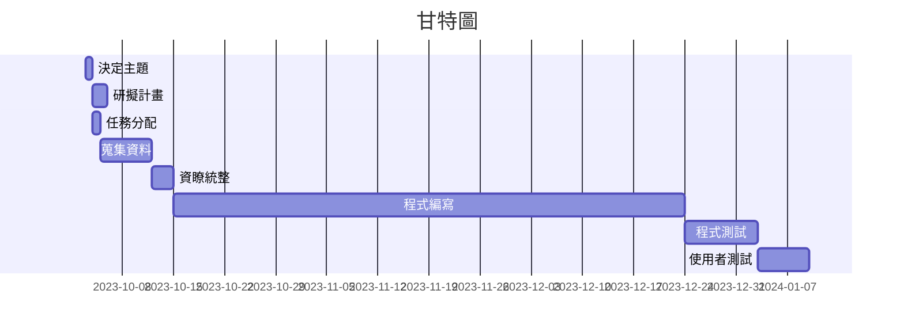

# Group_9 第九組
## 專題名稱:

## 小組成員:
#### *C110193217 劉芸廷*
#### C110193228 翁悅庭
#### C110118223 龔倢
#### C110118213 陳盈臻

## 專題簡介:
隨著科技技術的進步，網際網路隨之蓬勃發展，使得知識的整合以及傳播更加快速且不受限於時空限制，可以透過網路取得許多的學習資源，同時，有更加多元化的學習管道能夠做選擇，也因此逐漸促成了線上學習的風潮。不過目前市面上並沒有平台是針對幼兒所創建的學習資源整合平台，因此本團隊旨在透過此app，讓孩童能夠在遊戲中學習，增加學習的趣味性的同時，也補足學習資源不足的缺陷。而均一教育平台就是一個提供跨年級、多學科的免費線上學習平台，成立初衷是希望能打造每個孩子都有「均等」的教育體驗，實現全世界的教育理想。我們將藉此信念延伸設計出一款以遊戲化提供學習資源的APP，依照不同的科目去設計趣味小遊戲，目的是希望能使得資源較匱乏的偏鄉孩童以及育幼院的小朋友也能夠在快樂的氛圍下學習，進而對自我更加認同，並且從中激發對學習的熱忱。

| **職位** | **姓名** | **學號** | **工作分配**|
| :---     |  :---       |  :---   | :---      |
|   組長   | 劉芸廷   | C110193217  |           |
|   組員   | 翁悅庭   | C110193228  |           |
|   組員   | 龔倢     | C110118223  |           |
|   組員   | 陳盈臻   | C110118213  |           |

### 分工表
|  *編號*  |  *任務內容*  |  *所需時(天)*  |  *前置任務*  |  *負責人*  |
| :------: |   :------:  |    :------:   |   :------:  |  :------:  |
|     1    |   決定主題   |       1       |      /      |劉芸廷、翁悅庭、龔倢、陳盈臻|
|     2    |   研擬計畫   |       2       |      1      |劉芸廷、翁悅庭、龔倢、陳盈臻|
|     3    |   任務分配   |       1       |      1      |劉芸廷、翁悅庭、龔倢、陳盈臻|
|     4    |   蒐集資料   |       7       |      3      |劉芸廷、翁悅庭、龔倢、陳盈臻|
|     5    |   資料統整   |       3       |      4      |劉芸廷、翁悅庭、龔倢、陳盈臻|
|     6    |   程式編寫   |       70      |      5      |劉芸廷、翁悅庭、龔倢、陳盈臻|
|     7    |   程式測試   |       10      |      6      |劉芸廷、翁悅庭、龔倢、陳盈臻|
|     8    |  使用者測試  |       7       |      7      |劉芸廷、翁悅庭、龔倢、陳盈臻|
---

### 甘特圖

